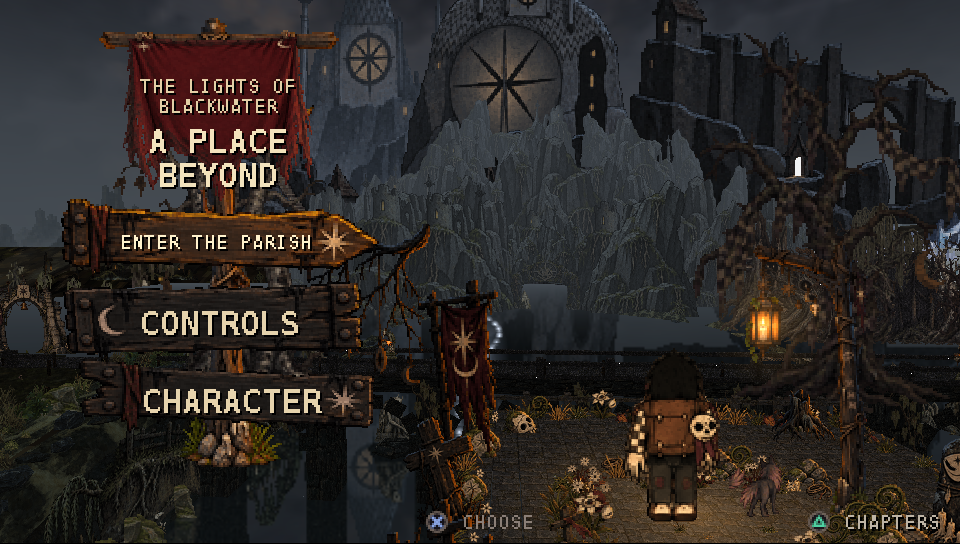
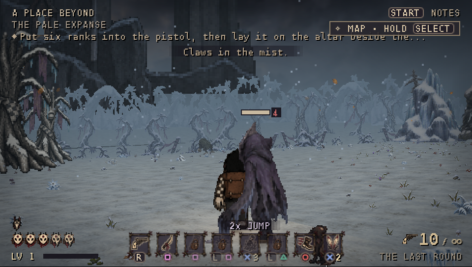
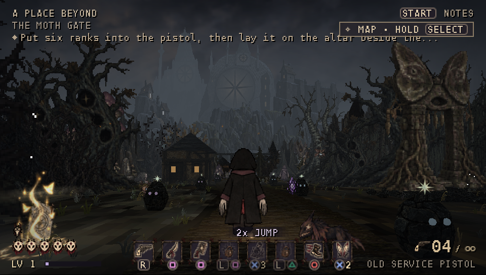
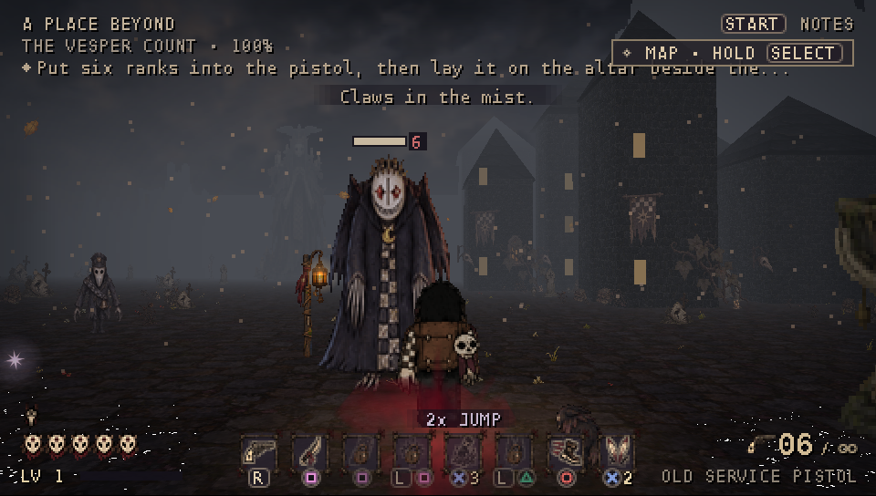
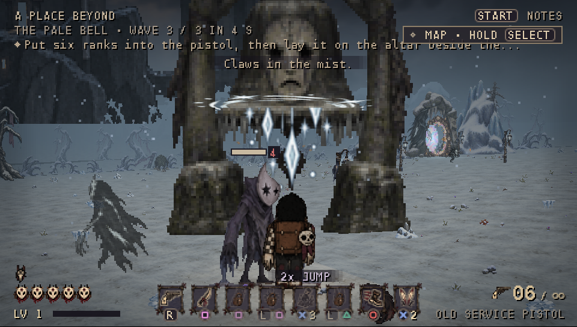
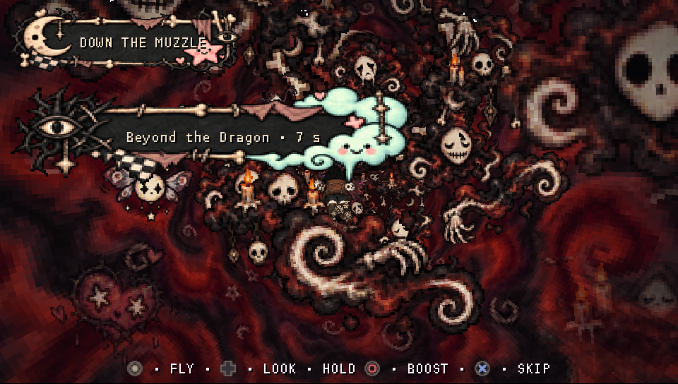
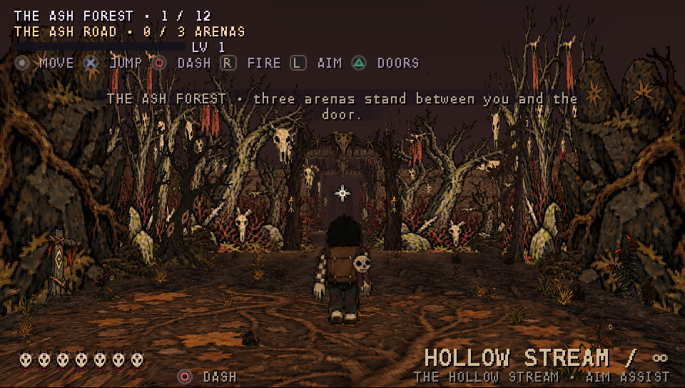
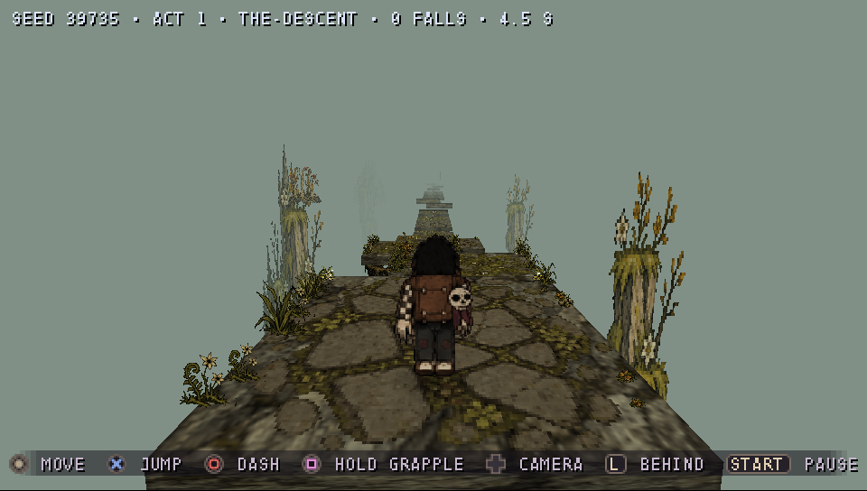
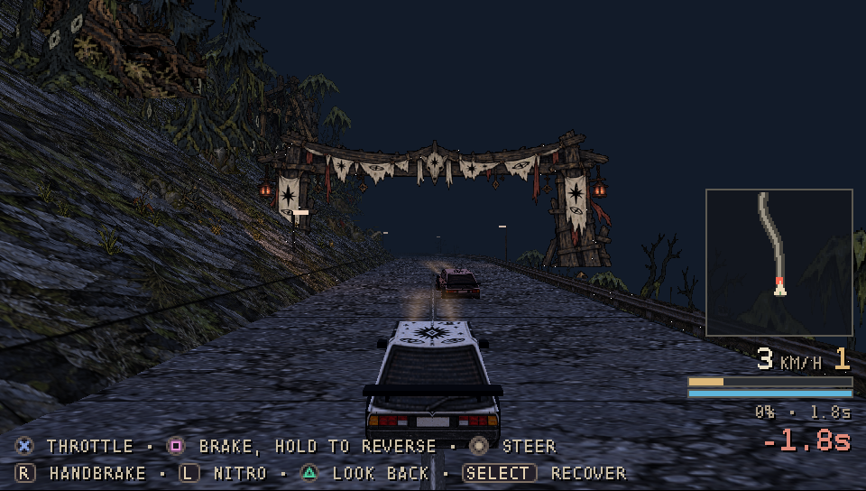

# A Place Beyond — PSP edition

A dark, hand-painted action adventure, ported to the **Sony PSP** from the web game *A Place Beyond*.

Walk the forest road to Blackwater Parish, row the drowned lake, light the lanterns of the Mire, hunt the Vesper Count
through the city, wake the Pale Bell — then take the three journeys beyond: the dive down the pistol's muzzle, the
climb, and the night drive over the pass.

### ⬇️ [Download the latest release](../../releases/latest)

| | |
|---|---|
|  |  |
|  |  |
|  |  |
|  |  

## Features

- The whole open world of stage one, with its bosses, quests, shrines and secrets
- Three journey stages: a twin-stick dive, a parkour climb and a night car race over the pass
- Upgrade tree, journal, map and four playable characters
- The original painted art, music and voice lines
- 30 fps on a real PSP-2000

## Requirements

- **PSP-2000, PSP-3000 or PSP Go** with custom firmware (PRO, ME or ARK-4).
  Tested on a PSP-2000 with 6.61 PRO-C. The **PSP-1000 is not supported** (it lacks the extra memory).
- PS Vita / PS TV with Adrenaline should work (untested).
- **PPSSPP** on PC, Android and iOS works too.
- About 92 MB free on the memory stick.

## Install

1. Download `A-Place-Beyond-PSP-v0.9.zip` from [Releases](../../releases/latest) and unzip it.
2. Copy the `PSP` folder to the root of your memory stick, so you have
   `PSP/GAME/APlaceBeyond/EBOOT.PBP` and the `PSP/GAME/APlaceBeyond/data` folder (24 `.pak` files, all needed).
3. On the PSP: **Game › Memory Stick › A Place Beyond**. In PPSSPP, open the `EBOOT.PBP`.

Updating: copy the new version over the old folder; your save (`data/save.bin`) is kept.

## Controls

| Button | Action |
|---|---|
| Analog stick | Move (push fully to run) |
| D-pad | Turn and tilt the camera |
| R / hold L | Fire the pistol / aim over the shoulder (tap L recentres the camera) |
| ✕ | Jump, double jump (third press in the air: ground slam, once learned) |
| ○ | Dash |
| □ | Light cut; hold for the heavy cut · L + □: eye burst |
| △ | Interact, board the boat, reload · L + △: call the guardian hound |
| Select / hold Select | Upgrade tree / map |
| Start | Pause: journal, options, map |

On the title screen, △ opens **CHAPTERS** to jump straight into the journey stages. The release zip includes a cheat
menu (`CHEATS.txt`) for anyone who just wants to look around.

## Known issues (beta)

- The game saves at chimes, doors and the finale; the PSP may pause for a moment while it writes.
- Stage four sees half as far as the web version, to keep 30 fps on real hardware.
- The larger areas take a few seconds to load from a real Memory Stick.

Found a bug? Please open an [issue](../../issues) with your PSP model, firmware and what happened.

## Credits & license

*A Place Beyond* — game, art and design: **bcaa777**.
The PSP edition is built with the open [PSPSDK toolchain](https://github.com/pspdev); third-party notices are in the
release zip (`THIRD_PARTY_NOTICES.txt`).

The game and all its content are © bcaa777. It is free to download and play — please share a link to this page
rather than re-uploading the files.
